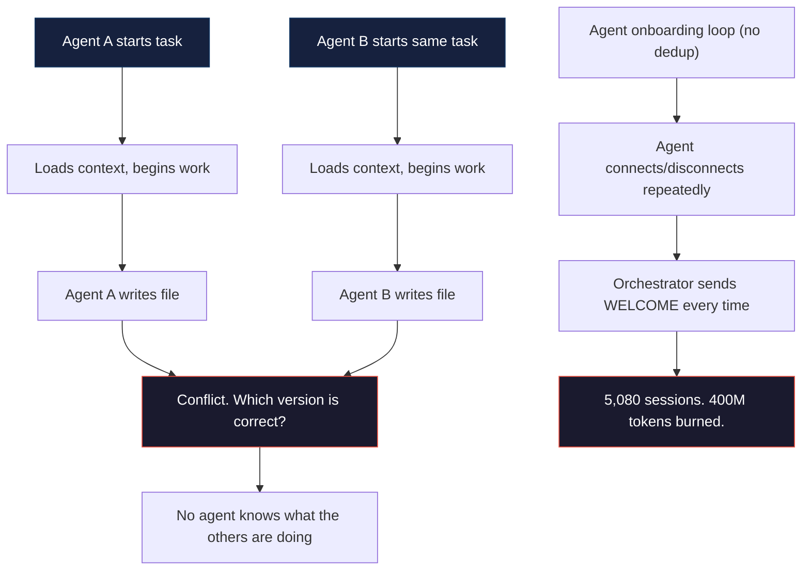
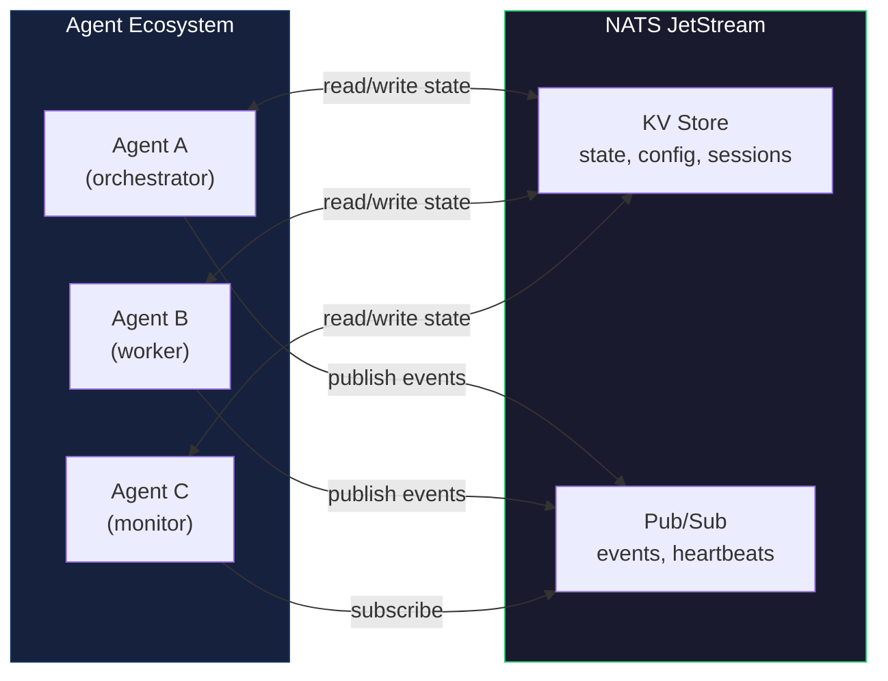
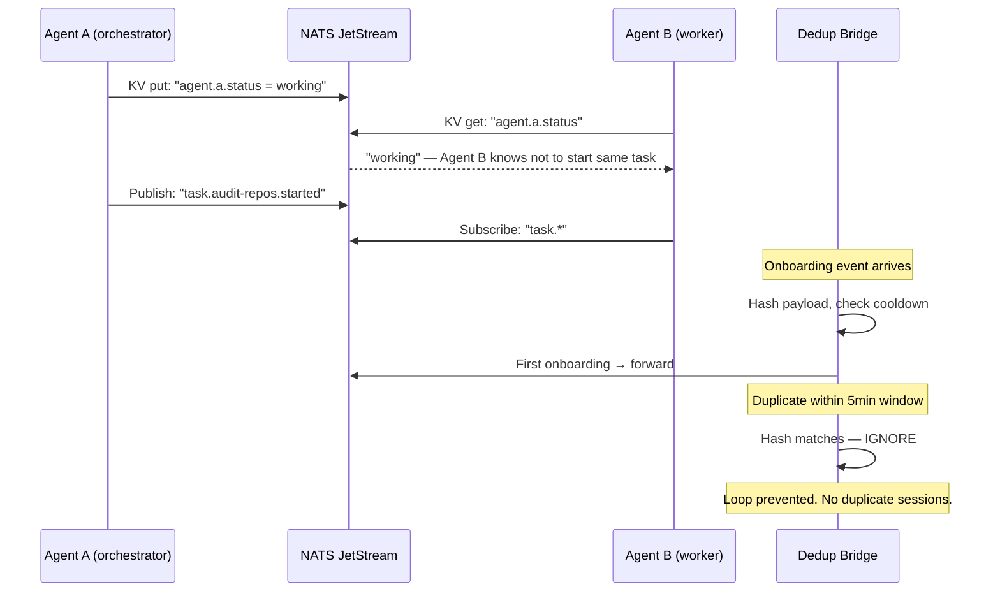

# NATS Agent State Sharing

[](https://opensource.org/licenses/MIT)
[](https://python.org)
[](https://nats.io)

**Shared runtime state for multi-agent AI systems. Stop your agents from working blind.**

---

> In a multi-agent system, every agent starts a session with zero knowledge of what other agents are doing. Without shared state, they duplicate work, miss context, and — in the worst case — trigger cascading failures like the [400M token loop](https://github.com/nerudek/hermes-token-loop-postmortem). NATS Agent State Sharing gives every agent a single source of truth.

---

## The problem



AI agents are stateless by default. Each session is an island — it doesn't know what other agents have done, are doing, or will do. Without shared state, you get:

- **Duplicate work** — two agents solving the same problem independently
- **Context loss** — agent A discovers something critical, agent B never learns about it
- **Cascading failures** — an onboarding loop with no deduplication burns 400M tokens because no one agent can see the pattern

## What NATS Agent State Sharing does

1. **Key-Value store accessible to all agents** — write once, read from anywhere. Every agent sees the same state.
2. **Pub/sub event bus** — agents publish events (task started, task done, error). Other agents subscribe and react.
3. **Message deduplication** — the `bridge/dedup.py` module prevents the exact onboarding loop that burned 400M tokens
4. **Session tracking** — which agents are active, what they're working on, when they last reported



---

## Why not just files on disk / Redis / HTTP API?

| Alternative | Problem | Why it fails |
|-------------|---------|-------------|
| Files on disk | No real-time updates, no atomic cross-agent writes | Agent A writes a file. Agent B reads it. Agent C overwrites it. Nobody knows who won. |
| Redis | Single point of failure, requires separate infrastructure | Adds another service to manage. NATS is already running for messaging — KV comes free. |
| HTTP REST API | Request/response only — no push, no streaming | Agents must poll. Polling means latency and wasted cycles. Events should push. |
| SQLite | No pub/sub, no clustering | Great for single-agent persistence. Useless for multi-agent real-time coordination. |
| Custom TCP protocol | Reinventing the wheel. Auth, retry, serialization — all yours to maintain | NATS solves all of that. 34KB binary, zero dependencies. |

---

## Quick start

```bash
git clone https://github.com/nerudek/nats-agent-state-sharing
cd nats-agent-state-sharing

# Start NATS with JetStream
nats-server -js &

# Run the bridge with deduplication
python3 bridge/dedup.py
```

**60-second test:**
```python
import nats
import json

async def main():
    nc = await nats.connect("nats://localhost:4222")
    js = nc.jetstream()
    
    # Create a KV bucket
    kv = await js.create_key_value(bucket="agents")
    
    # Write state
    await kv.put("agent.a.status", b'{"status":"working","task":"audit-repos"}')
    
    # Read state (from any agent, any machine)
    entry = await kv.get("agent.a.status")
    print(f"Agent A status: {entry.value.decode()}")

    await nc.close()
```

---

## How it works



### Deduplication layer

The `bridge/dedup.py` module hashes incoming message payloads and maintains a cooldown window (default: 5 minutes). Duplicate hashes within the window are silently dropped. This is the exact fix that stopped the 400M token onboarding loop.

---

## Stats and context

- **NATS binary: 34KB** — no dependency hell. Single static binary.
- **JetStream KV throughput: ~100K reads/sec** on commodity hardware
- **Message deduplication adds <5ms latency** — hash computation is negligible
- **400M tokens burned in one incident** before deduplication was added ([postmortem](https://github.com/nerudek/hermes-token-loop-postmortem))
- **0 duplicate sessions** since the dedup bridge was deployed

---

## Installation

```bash
git clone https://github.com/nerudek/nats-agent-state-sharing
cd nats-agent-state-sharing
pip install nats-py

# Start NATS server
nats-server -js -c nats.conf &
```

**Requirements:**
- Python 3.9+
- NATS server with JetStream enabled
- `nats-py` library
- No external databases, no Redis, no message brokers

---

## Repository structure

```
nats-agent-state-sharing/
├── bridge/
│   └── dedup.py            # Message deduplication bridge
├── README.md               # THIS FILE
├── SKILL.md                # Agent skill reference
└── .gitignore
```

---

## Known problems

| Problem | Status | Workaround |
|---------|--------|------------|
| Cooldown window can mask legitimate rapid re-onboarding | Mitigated | Window is configurable per agent type. Set `COOLDOWN_SECONDS` in dedup.py |
| No persistent KV backend in standalone mode | By design | JetStream file storage is on disk. For clustering, run NATS in cluster mode |
| `nats-py` async-only | Open — tracking upstream | Wrap sync code in `asyncio.run()`. Thread-safe for simple operations |

---

## Contributing

- **New state patterns:** PRs for agent coordination patterns (leader election, work queues, heartbeats)
- **Language bindings:** Currently Python-only. Go and TypeScript bindings welcome
- **Bug reports:** Use the `bug` label. Include NATS server version and `dedup.py` log output

---

## License

MIT — see [LICENSE](LICENSE).

---

*Built by [nerudek](https://github.com/nerudek)*

☕ **Support:** [PayPal.me/nerudek](https://www.paypal.me/nerudek) | [Dev.to](https://dev.to/nerudek)
